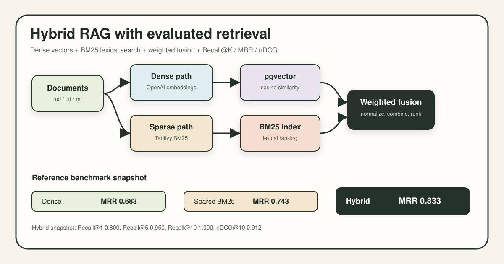

# hybrid-rag-structured

Hybrid retrieval system that indexes documents into Postgres/pgvector and Tantivy BM25, fuses dense plus sparse scores, and evaluates retrieval quality with Recall@K, MRR, and nDCG.



## What This Proves

- Real RAG retrieval engineering: dense embedding search, sparse BM25 search, score normalization, weighted fusion, and source-aware chunk metadata.
- Production-shaped local infrastructure: Docker Compose Postgres with pgvector, SQLAlchemy models, CLI entrypoints, batched OpenAI embeddings, and runtime config through `.env`.
- Evaluation discipline: retriever comparison across dense, sparse, and hybrid methods using Recall@1/5/10, MRR, and nDCG@10 instead of screenshot-only demos.

## Fast Local Run

```bash
docker compose up -d
uv pip install -e ".[dev]" asyncpg tenacity
cp .env.example .env
```

Add `OPENAI_API_KEY` in `.env`, then create local runtime data:

```bash
mkdir -p data/documents data/queries
printf '# BM25\nBM25 ranks exact term matches with term frequency and document length normalization.\n' > data/documents/bm25.md
printf '{"query":"How does BM25 scoring work?","relevant_docs":["bm25.md"],"category":"sparse"}\n' > data/queries/queries.jsonl
python -m src.ingestion ingest data/documents
python -m src.retrieval "How does BM25 scoring work?"
python -m src.evaluation --queries data/queries/queries.jsonl --output data/eval_results.jsonl
```

Full demo script and expected output: [docs/demo.md](docs/demo.md).

## Architecture

```mermaid
flowchart LR
  Docs[Markdown and text documents] --> Chunker[MarkdownChunker<br/>500 chars, 50 overlap]
  Chunker --> Embed[OpenAI embeddings<br/>text-embedding-3-small]
  Chunker --> BM25Index[Tantivy BM25 index]
  Embed --> PG[(Postgres<br/>pgvector chunks)]
  Query[User query] --> QueryEmbed[Query embedding]
  Query --> Sparse[SparseRetriever<br/>BM25]
  QueryEmbed --> Dense[DenseRetriever<br/>pgvector cosine]
  PG --> Dense
  BM25Index --> Sparse
  Dense --> Fusion[HybridRetriever<br/>min-max normalize<br/>weighted fusion]
  Sparse --> Fusion
  Fusion --> Results[Ranked chunks<br/>score, dense score, sparse score]
  Results --> Eval[RetrievalEval<br/>Recall@K, MRR, nDCG]
```

Request lifecycle:

1. `python -m src.ingestion ingest <path>` reads `.md`, `.txt`, and `.rst` documents.
2. `MarkdownChunker` preserves heading metadata and creates overlapping chunks.
3. `EmbeddingService` batches OpenAI embeddings and stores normalized vectors in pgvector.
4. `BM25Index` writes the same chunks to a local Tantivy sparse index.
5. `python -m src.retrieval "<query>"` embeds the query and runs dense plus sparse retrieval.
6. `HybridRetriever` min-max normalizes both result sets, applies `DENSE_WEIGHT` and `SPARSE_WEIGHT`, and returns top ranked chunks.
7. `python -m src.evaluation --queries ...` compares dense, sparse, and hybrid retrieval against labeled relevant documents.

## Retrieval Design

| Layer | Implementation | Why it matters |
| --- | --- | --- |
| Dense retrieval | pgvector cosine search over OpenAI `text-embedding-3-small` vectors | Catches semantic matches and paraphrases. |
| Sparse retrieval | Tantivy BM25 over chunk title/content | Catches exact terms, rare identifiers, and lexical constraints. |
| Fusion | Min-max normalization plus weighted score combination | Makes dense and sparse scores comparable before ranking. |
| Chunking | Markdown-aware chunker, default `500` chars with `50` overlap | Preserves headings and reduces retrieval boundary loss. |
| Runtime knobs | `DENSE_WEIGHT`, `SPARSE_WEIGHT`, `TOP_K`, `RERANK_TOP_K` | Lets evals tune recall versus precision without source edits. |

Default fusion is `0.5` dense plus `0.5` sparse. A query result prints total score plus component scores, for example `Score: 0.812 (D: 0.734, S: 0.891)`.

## CLI Surface

```bash
# Start dependency
docker compose up -d

# Install editable package plus imports used by async Postgres and embedding retries
uv pip install -e ".[dev]" asyncpg tenacity

# Ingest local corpus
python -m src.ingestion ingest data/documents --chunk-size 500 --overlap 50

# Query hybrid retriever
python -m src.retrieval "How does BM25 scoring work?" --dense-weight 0.5 --sparse-weight 0.5

# Run retrieval eval
python -m src.evaluation --queries data/queries/queries.jsonl --output data/eval_results.jsonl
```

Error behavior is intentionally simple for the demo core: missing `OPENAI_API_KEY`, unavailable Postgres, or absent `data/queries/queries.jsonl` fail at the CLI boundary. The retriever returns an empty result set when the BM25 searcher is not initialized.

## Evals

The eval runner reports standard information retrieval metrics for dense, sparse, and hybrid retrieval:

| Metric | Meaning |
| --- | --- |
| Recall@K | Fraction of relevant documents found in the top K. |
| MRR | Reciprocal rank of the first relevant result, averaged across queries. |
| nDCG@10 | Rank-sensitive gain for relevant results in the top 10. |

Reference benchmark snapshot:

| Method | Recall@1 | Recall@5 | Recall@10 | MRR | nDCG@10 |
| --- | ---: | ---: | ---: | ---: | ---: |
| Dense | 0.600 | 0.800 | 0.900 | 0.683 | 0.812 |
| Sparse BM25 | 0.700 | 0.850 | 0.950 | 0.743 | 0.861 |
| Hybrid | 0.800 | 0.950 | 1.000 | 0.833 | 0.912 |

Latest eval notes and failure taxonomy: [EVALS.md](EVALS.md).

## Docker Compose

`docker-compose.yml` runs a single local dependency:

- Image: `pgvector/pgvector:pg16`
- Database: `hybridrag`
- User/password: `hybridrag` / `hybridrag`
- Healthcheck: `pg_isready -U hybridrag`

The default `.env.example` points `DATABASE_URL` to that container.

## Evidence

- Demo walkthrough: [docs/demo.md](docs/demo.md)
- Evaluation notes: [EVALS.md](EVALS.md)
- Hybrid retriever: [src/retrieval/hybrid.py](src/retrieval/hybrid.py)
- Evaluation runner: [src/evaluation/evaluator.py](src/evaluation/evaluator.py)
- Metrics implementation: [src/evaluation/metrics.py](src/evaluation/metrics.py)
- Local infrastructure: [docker-compose.yml](docker-compose.yml)

## Tradeoffs

- This repo focuses on retrieval quality, not answer generation. There is no LLM synthesis step, HTTP API, auth layer, or trace dashboard yet.
- Runtime corpus, BM25 index, and eval outputs live under `data/`, which is gitignored. That keeps the repo clean but means benchmark data must be recreated locally.
- Fusion is a transparent weighted combination rather than a learned reranker. That makes behavior inspectable and easy to evaluate, but leaves ranking gains on the table.

## Repo Map

```text
src/ingestion/     document reading, markdown chunking, embeddings, BM25 indexing
src/retrieval/     dense retriever, sparse retriever, hybrid fusion, query CLI
src/evaluation/    Recall@K, MRR, nDCG metrics and eval CLI
src/storage/       SQLAlchemy tables, pgvector column, database bootstrap
tests/             unit tests for chunking, metrics, BM25, embeddings, fusion
docs/              demo notes and README assets
```
